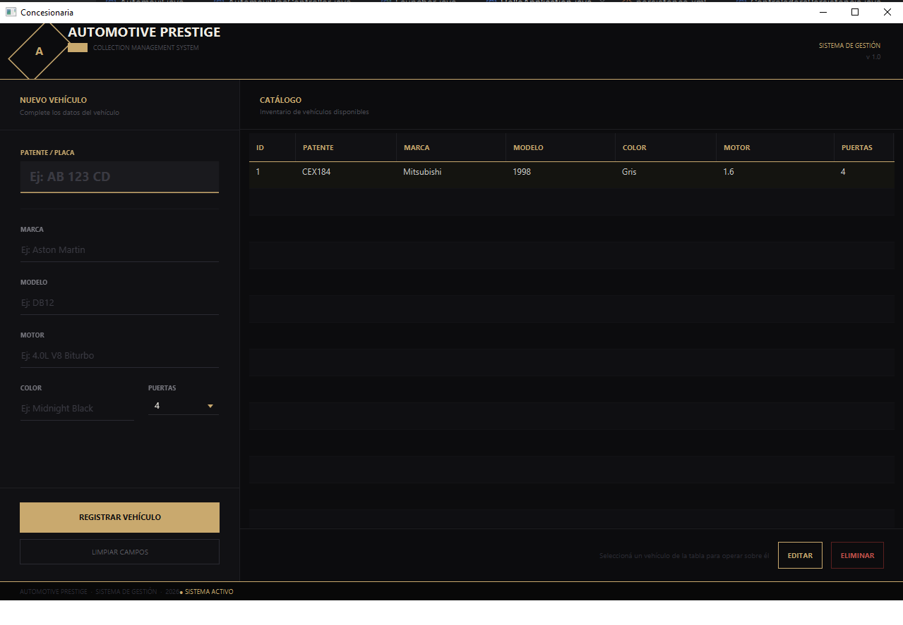

# 🚗 Automotive Prestige — Sistema de Gestión de Vehículos

Sistema de escritorio desarrollado en **Java + JavaFX** para la gestión del inventario de vehículos de una concesionaria. Permite realizar un CRUD completo sobre el catálogo de autos disponibles para la venta.

> Ejercicio Integrador Nº 2 — Curso de Programación Java

---

## 📸 Vista de la aplicación



---

## ✨ Funcionalidades

- ✅ **Crear** nuevos vehículos con todos sus datos
- ✅ **Leer** el catálogo completo en tabla con todas las columnas
- ✅ **Editar** vehículos existentes seleccionando una fila de la tabla
- ✅ **Eliminar** vehículos con confirmación previa
- ✅ **Persistencia** de datos con JPA + MySQL
- ✅ **Interfaz dark luxury** con tema dorado inspirado en autos de alta gama

---

## 🛠️ Tecnologías utilizadas

| Tecnología | Versión | Rol |
|---|---|---|
| Java | 25 | Lenguaje principal |
| JavaFX | 21.0.6 | Interfaz gráfica |
| JPA / EclipseLink | 4.0.2 | Persistencia de datos |
| MySQL | 8.3.0 | Base de datos |
| Maven | — | Gestión de dependencias |
| IntelliJ IDEA | 2025.x | IDE de desarrollo |

---

## 📁 Estructura del proyecto

```
src/main/
├── java/
│   ├── ejercicio.concesionaria.igu/           # Interfaz Gráfica de Usuario
│   │   ├── HelloApplication.java              # Punto de entrada JavaFX
│   │   ├── HelloController.java               # Controlador de la vista
│   │   └── Launcher.java                      # Launcher de la aplicación
│   ├── ejercicio.concesionaria.logica/        # Lógica de negocio
│   │   ├── Automovil.java                     # Entidad Automovil
│   │   └── Controladora.java                  # Intermediario entre IGU y Persistencia
│   └── ejercicio.concesionaria.persistencia/  # Capa de acceso a datos
│       ├── AutomovilJpaController.java         # CRUD con JPA
│       └── ControladoraPersistencia.java       # Fachada de persistencia
└── resources/
    ├── ejercicio/concesionaria/igu/
    │   ├── automovil-view.fxml                # Diseño de la interfaz
    │   └── automotive.css                     # Estilos dark luxury
    └── META-INF/
        └── persistence.xml                    # Configuración JPA
```

---

## 🗺️ Arquitectura — Modelo de Capas

```
IGU  ──►  Controladora  ──►  ControladoraPersistencia  ──►  Base de datos
(Vista)    (Lógica)              (Persistencia / JPA)          (MySQL)
```

Cada capa solo se comunica con la siguiente, respetando la separación de responsabilidades.

---

## 🧩 Entidad Automovil

| Campo | Tipo | Descripción |
|---|---|---|
| `id` | `long` | Identificador único (autogenerado) |
| `marca` | `String` | Marca del vehículo |
| `modelo` | `String` | Modelo del vehículo |
| `motor` | `String` | Descripción del motor |
| `color` | `String` | Color del vehículo |
| `patente` | `String` | Patente / Placa |
| `cantPuertas` | `int` | Cantidad de puertas |

---

## ⚙️ Requisitos previos

- [Java JDK 25](https://www.oracle.com/java/technologies/downloads/)
- [MySQL 8+](https://dev.mysql.com/downloads/)
- [Maven](https://maven.apache.org/)
- [IntelliJ IDEA](https://www.jetbrains.com/idea/) (recomendado)

---

## 🚀 Cómo ejecutar el proyecto

**1. Clonar el repositorio**
```bash
git clone https://github.com/RycardoMartynez/concesionaria.git
cd concesionaria
```

**2. Crear la base de datos en MySQL**
```sql
CREATE DATABASE concesionariodb;
```

**3. Configurar credenciales en `persistence.xml`**

Editá el archivo `src/main/resources/META-INF/persistence.xml`:
```xml
<property name="jakarta.persistence.jdbc.url"
          value="jdbc:mysql://localhost:3306/concesionariodb?useSSL=false&amp;serverTimezone=UTC"/>
<property name="jakarta.persistence.jdbc.user"     value="TU_USUARIO"/>
<property name="jakarta.persistence.jdbc.password" value="TU_CONTRASEÑA"/>
```

**4. Ejecutar**
```bash
mvn clean javafx:run
```

> Las tablas se crean automáticamente gracias a `eclipselink.ddl-generation = create-or-extend-tables`

---

## 📋 Flujo de edición

1. Seleccioná un vehículo en la tabla **Catálogo**
2. Presioná **EDITAR** — los datos se cargan automáticamente en el formulario
3. Modificá los campos necesarios
4. Presioná **REGISTRAR VEHÍCULO** — el sistema detecta que es una edición y hace el `UPDATE`
5. La tabla se actualiza automáticamente

---

## 👨‍💻 Autor

**RycardoMartynez**
Proyecto desarrollado como Ejercicio Integrador Nº 2 para el curso de **Programación en Java**.

---

## 📄 Licencia

Este proyecto es de uso educativo.
